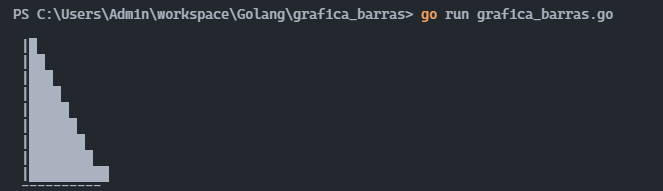

##Fecha: 11/02/2022

# Gráfica de Barras

El propósito de este programa es que mediante una función que reciba varios argumentos de tipo entero y un caracter de relleno, genere una gráfica en modo texto en la terminal.


## Requerimientos funcionales
### ejemplo 1
Si los datos son 1, 2, 3, 4, 5, "+" la salida deberá ser algo parecido a:
```
│    +
│   ++
│  +++
│ ++++
│+++++
└─────
 ```
(cada parametro se convertira en la altura de la barra)

### ejemplo 2
Si los datos son 3, 0, 2, 6 "*" la salida deberá ser algo parecido a:

```
│    *
│    *
│    *
│*   *
│*  **
│*  **
└─────
 ```

 ## Pantallazos de su ejecución con al menos dos series de argumentos distintos.

### Ejemplo de entrada 1

```GO
func main() {

	var num = []int{10, 9, 8, 7, 6, 5, 4, 3, 2, 1}
	var symbol = "█"
	numax := findMax(num)
	grafica(numax, num, symbol)

}
 ```
 ### Salida en terminal

 
 ### Ejemplo de entrada 2

 ```Go
 func main() {

	var num = []int{4, 6, 2, 0, 5, 7, 1}
	var symbol = "▍"
	numax := findMax(num)
	grafica(numax, num, symbol)

}
```
### Salida en terminal


>>>>>>> f42bce6 (addimg)
