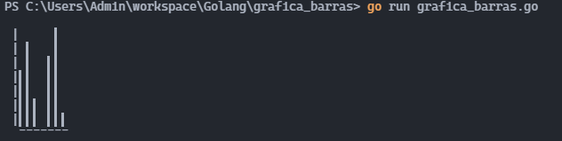

# Gráfica de Barras

El propósito de este programa es que mediante una función que reciba varios argumentos de tipo entero y un caracter de relleno, genere una gráfica en modo texto en la terminal.


## Requerimientos funcionales

Si los datos son 1, 2, 3, 4, 5, "+" la salida deberá ser algo parecido a:
```
│    +
│   ++
│  +++
│ ++++
│+++++
└─────
 ```
(cada digito conmo parametro se convertira en la altura)

### ejemplo 2
Modifica el programa para soportar un número variable de ancho y alto para cada dígito.
Por ejemplo, para ancho = 3 y alto = 2 el dígito 2 sería:

```
│    *
│    *
│    *
│*   *
│*  **
│*  **
└─────
 ```

 ## pantallazos de su ejecución con al menos dos series de argumentos distintos.

### Resultado 1
``` 
func main() {

	var num = []int{10, 9, 8, 7, 6, 5, 4, 3, 2, 1}
	var symbol = "█"
	numax := findMax(num)
	grafica(numax, num, symbol)

}
 ```
 ### Resultado en terminal
 
 ### Resultado 2
 ```
 func main() {

	var num = []int{4, 6, 2, 0, 5, 7, 1}
	var symbol = "▍"
	numax := findMax(num)
	grafica(numax, num, symbol)

}
```
### Resultado en terminal


>>>>>>> f42bce6 (addimg)
